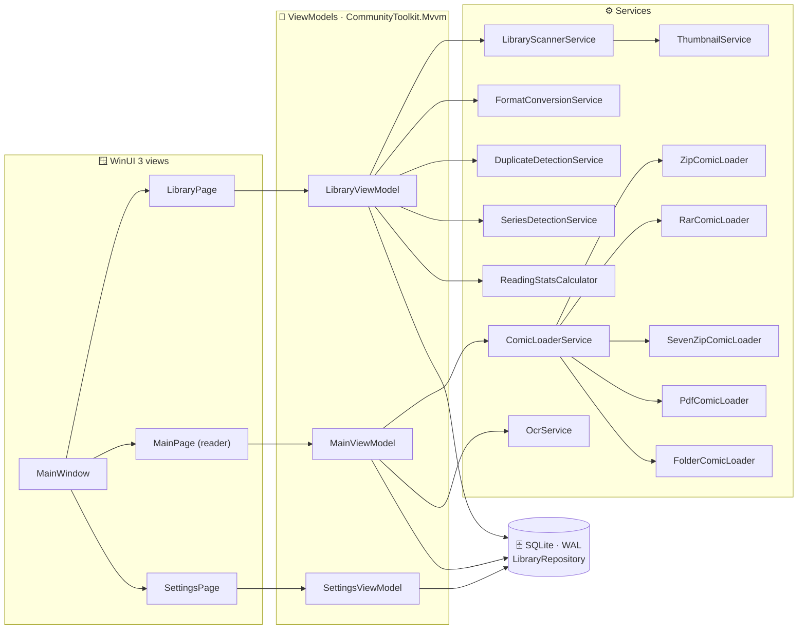

<!-- ═══════════════════════════════════════════════════════════════════════
     KOMIK — README
     Animated artwork lives in komik-website/public/readme/ (pure SVG + CSS,
     no external services required). Honors prefers-reduced-motion.
     ═══════════════════════════════════════════════════════════════════════ -->

<div align="center">

<a href="#-download--install">
  
</a>

<br />

<a href="https://github.com/mohitbansal25082006/KomiK/releases/latest/download/Komik-Setup.exe"></a>
&nbsp;
<a href="https://komik-website-taupe.vercel.app/"></a>

<br /><br />


<br /><br />

**Komik** is a lightweight, high-performance, **local-only** Windows desktop reader for comics, manga and webtoons,<br />
built with **WinUI 3 (Windows App SDK)** and **C# / .NET 8** and designed around Windows 11 Fluent Design.

<sub>

**[Screenshots](#-see-it-in-action)** · **[Features](#-the-reading-engine)** · **[What's new](#-brand-new-in-110)** · **[Formats](#-every-format-zero-codecs)** · **[Install](#-download--install)** · **[Shortcuts](#-keyboard-first-reading)** · **[Privacy](#-your-comics-belong-on-your-pc)** · **[Architecture](#-under-the-hood)** · **[Build](#-build-it-yourself)** · **[Website](#-the-komik-website)**

</sub>


<br />

<table>
  <tr>
    <td align="center">
      <a href="https://komik-website-taupe.vercel.app/"><b>🌐&nbsp; Try Komik in your browser&nbsp; →</b></a><br />
      <sub>Read the complete demo comic in a working replica of the Komik reader. No install needed.</sub>
    </td>
  </tr>
</table>

</div>

> [!NOTE]
> **Privacy & offline architecture.** Komik is strictly offline and local-first. There is **no cloud sync, no account system, no telemetry or tracking, and zero external network calls anywhere in the application**. All comic metadata, reading progress, cover thumbnails, bookmarks and preferences stay on your own machine.


<a id="-see-it-in-action"></a>


### 🖥️ The Komik desktop app

<div align="center">


<sub><b>The library.</b> A comic-style cover grid with progress badges, favorites, filter chips, <b>Tags</b> and <b>Manage Tags</b>, plus Stats, Duplicates and Series &amp; Volumes one click away.</sub>

<br /><br />

<table>
  <tr>
    <td width="50%" align="center">
      <br />
      <sub><b>The reader.</b> A two-page spread with the floating toolbar and scrubber. The chrome auto-hides while you read.</sub>
    </td>
    <td width="50%" align="center">
      <br />
      <sub><b>Webtoon mode.</b> One long vertical strip, decoded in parallel. Zoom keeps your place, and comics reopen at the saved page.</sub>
    </td>
  </tr>
  <tr>
    <td width="50%" align="center">
      <br />
      <sub><b>Series &amp; Volumes.</b> <b>Continuation Series</b> and <b>By Creator</b> sections, with progress and a one-click <b>Continue</b> / <b>Read next</b>.</sub>
    </td>
    <td width="50%" align="center">
      <br />
      <sub><b>Series detail.</b> Gap check, progress, <b>Edit</b>, <b>Cover</b> and <b>Add Comics</b>, with the next issue marked <b>Up next</b>.</sub>
    </td>
  </tr>
  <tr>
    <td width="50%" align="center">
      <br />
      <sub><b>Reading Insights.</b> Active reading time, pages, streaks, Komik Wrapped and Top Series with exact progress, all computed locally.</sub>
    </td>
    <td width="50%" align="center">
      <br />
      <sub><b>Manage Tags.</b> Search, sort, used / unused filters, rename, merge and bulk-delete unused tags. Built for big tag lists.</sub>
    </td>
  </tr>
  <tr>
    <td colspan="2" align="center">
      <br />
      <sub><b>Settings → How Comics Open.</b> Page by page, two-page spread or webtoon, combined with comic (left to right) or manga (right to left). Everything saves instantly.</sub>
    </td>
  </tr>
</table>

<sub>Every screenshot uses an isolated demo library of original mock comics, including <b>Cyberpunk Chronicles</b>, the demo comic made for the Komik website, packed into real <code>.cbz</code> files.</sub>

</div>

<br />

### 🌐 Interactive Promotional Website

<div align="center">

<a href="https://komik-website-taupe.vercel.app/"></a>

<sub>Spreads · manga RTL · webtoon · color presets · bookmarks · dialogue search · full screen</sub>

</div>

The website holds a fully working replica of the reader, so visitors can read the whole demo comic in the browser before installing anything.

<div align="center">

<table>
  <tr>
    <td width="50%"></td>
    <td width="50%"></td>
  </tr>
  <tr>
    <td width="50%"></td>
    <td width="50%"></td>
  </tr>
</table>

&nbsp;

</div>


<a id="-the-reading-engine"></a>


<table>
<tr>
<td width="50%" valign="top">

#### 📖 High-performance reading canvas
- **Fit modes:** Fit Width `W`, Fit Height `H`, Actual Size `A` (1:1 with drag panning)
- **Zoom:** `Ctrl` `+` / `Ctrl` `-` or mouse wheel, reset with `Ctrl` `0`
- **Two-page spreads** `D` with cover isolation and correct physical-book pairing
- **Western LTR ↔ Manga RTL** `Ctrl` `R` flips page order, pairing *and* arrow keys
- **Natural page ordering**, so `page2` comes before `page10`
- Full-screen reading `F11` with auto-hiding chrome
- Smooth animated scroll back to the top on every page flip

</td>
<td width="50%" valign="top">

#### ⚡ Parallel webtoon engine
- Continuous vertical mode `V`
- A **6-worker pool** (`SemaphoreSlim(6)`) decodes high-resolution pages off the UI thread
- **Outward priority** from the active viewport, so pages are never blank
- Smooth mouse wheel & keyboard (`↑` `↓` `PgUp` `PgDn`) navigation
- Animated jumps (`ScrollToWebtoonPage`) from the scrubber and next/previous buttons

</td>
</tr>
<tr>
<td width="50%" valign="top">

#### 🔖 Progress, bookmarks & scrubber
- Automatic progress tracking in SQLite (last page + completion)
- A non-intrusive **"Resumed at page X"** toast when you reopen a comic
- **Visual scrubber** with page numbers and thumbnail previews
- **Bookmarks with notes** via `Ctrl` `D` / `Ctrl` `B`

</td>
<td width="50%" valign="top">

#### 🌙 Hardware LUT color presets
| Preset | Effect |
| :-- | :-- |
| **Original** | Natural scan colors |
| **Night Mode** | Amber warmth, dimmed background |
| **Sepia Tone** | Warm parchment paper |
| **High Contrast** | Sharper ink, deeper blacks |
| **Grayscale** | Pure monochrome |
| **Inverted** | Dark-mode inversion |

Plus **Brightness** (-100…+100), **Contrast** (0.5…2.0) and **Warmth** (-100…+100) sliders on a 256-entry lookup table.

</td>
</tr>
<tr>
<td width="50%" valign="top">

#### 🗂️ A library that files itself
- **Watched folders** with recursive indexing into local SQLite
- **Cover grid** and **detailed list** views
- Instant search, plus filter chips: All · Continue Reading · Favorites · Completed · Unread · Tags
- **Tag manager** with search, sort, usage counts, rename, merge and "delete unused"
- Friendly empty screens for every filter, and a colored sticker showing the active filter and its match count
- Sort by title (A–Z / Z–A), recently read, date added, page count or file size
- Disk-backed thumbnail cache for near-instant covers
- **Non-destructive:** removing a library entry never deletes your file, and removed comics can be added back from Settings

</td>
<td width="50%" valign="top">

#### ⚙️ Settings, details & shell integration
- Comic-style theme in **Light** (default) or **Dark**, or follow Windows
- **How Comics Open:** page by page, two-page spread or webtoon, left to right or manga right to left
- Reading & library defaults, page colors, monitored folders, thumbnail cache tools (all saved instantly)
- **Comic Details** editor: title, series, issue #, writers, artists, publisher, release date, summary
- **File associations**, so double-clicking a comic in Explorer opens it in Komik
- Command-line launch: `Komik.exe "<path-to-comic>"`

</td>
</tr>
</table>


<a id="-brand-new-in-110"></a>


| # | Feature | What it does |
| :-: | :-- | :-- |
| 1 | 🎨 **Comic-style app** | Halftone panels, ink borders, stickers and Bangers lettering across the library, reader, dialogs and toasts, in Light (now the default) and Dark. Cards lift and tilt, panels pop in, and menus open instantly. |
| 2 | 📚 **Series & Volumes** | Two sections: **Continuation Series** (issues, volumes, chapters and sequels, typo-tolerant, with gap detection) and **By Creator**. A creator collection can move to Continuation Series, but never the reverse. |
| 3 | ✏️ **Series editing** | Edit any series: rename, drag the reading order, auto-order, pick the cover, remove comics, toggle auto-update. **+ Add Comics** has search and filters, and a right-click menu works on every comic inside a series. |
| 4 | 🏷️ **Tag manager** | Search, sort by name or use, used / unused filters, rename, merge and delete. Tagging a comic is instant, and pressing Enter creates a new tag. |
| 5 | 🧭 **Smarter filters** | Every empty filter, tag or search shows a comic-style screen with a helpful next step. The active filter appears as a colored sticker with its match count and a clear button. |
| 6 | 📖 **How Comics Open** | Choose page by page, two-page spread or webtoon, plus comic (left to right) or manga (right to left), globally in Settings. Comics open that way at their saved page. |
| 7 | ⚡ **Parallel Webtoon engine** | A 6-worker concurrent decoder with outward viewport priority, an animated auto-hiding toolbar, live zoom percentage and zoom that keeps your place. |
| 8 | 📊 **Reading Stats & Komik Wrapped** | Active reading time (idle capped), pages actually viewed, streaks, periods and **Top Series** with exact page-based progress. |
| 9 | 👥 **Duplicate Manager** | Scores copies by identical bytes, same series and issue, or same cleaned title, explains why, and recommends the copy to keep. Deleting works even when a file was just in use. |
| 10 | 🔍 **Offline OCR** | Windows' built-in `Windows.Media.Ocr` groups speech bubbles in reading order (right to left for manga), tiles tall pages and filters art noise. Dialogue search jumps to the page. No cloud APIs. |
| 11 | ♻️ **Add back removed comics** | Removed comics are remembered and skipped by rescans. Settings lists every comic in your folders that isn't in the library, so you can bring them back. |
| 12 | 🗜️ **Archive → CBZ converter** | Lossless repacking of CBR / CB7 / ZIP / RAR / 7Z and image folders, plus PDF rasterization, into clean zero-padded CBZ files. |
| 13 | 🧭 **Responsive top bar** | A single accent **ADD** dropdown (Add Folder / Add Comic), horizontal mouse-wheel scrolling and a layout that adapts to any window width. |
| 14 | 🪟 **Window memory** | Restores size, position and maximized state on every launch. |
| 15 | 💾 **Portable backups** | A `.komikbackup` JSON file with history, bookmarks, notes, favorites, tags and settings, imported without conflicts. |


<a id="-every-format-zero-codecs"></a>


| Format | Type | Engine | Notes |
| :-- | :-- | :-- | :-- |
| 🟨 **`.cbz` / `.zip`** | Comic Book ZIP | `System.IO.Compression` | Streams pages straight from the archive |
| 🟥 **`.cbr` / `.rar`** | RAR4 & RAR5 | SharpCompress (managed) | No `unrar.dll`; password-locked files are rejected cleanly |
| 🟦 **`.cb7` / `.7z`** | 7-Zip LZMA / LZMA2 | SharpCompress (managed) | Solid archives, no 7z CLI needed |
| 🟧 **`.pdf`** | Portable Document | Docnet.Core (PDFium) | High-quality rasterization |
| ⬜ **Image folders** | JPEG · PNG · WEBP · BMP · GIF | Natural sort comparer | Point Komik at any folder |

> [!TIP]
> **Zero external dependencies.** RAR and 7-Zip decoding are 100% managed .NET, with no command-line tools or native DLLs to install.


<a id="-download--install"></a>


<table>
<tr>
<td width="55%" valign="top">

### 🚀 In four panels

1. **Download** [`Komik-Setup.exe`](https://github.com/mohitbansal25082006/KomiK/releases/latest/download/Komik-Setup.exe) from [GitHub Releases](https://github.com/mohitbansal25082006/KomiK/releases).
2. **Run** the setup wizard.
3. **Choose** whether to add a Desktop shortcut (off by default), and keep file associations enabled so `.cbz` `.cbr` `.cb7` `.zip` `.rar` `.7z` `.pdf` open in Komik.
4. **Install.** Komik goes to `C:\Program Files\Komik` with a Start Menu shortcut and a clean uninstaller under *Settings → Installed Apps*.

</td>
<td width="45%" valign="top">

### 🖥️ System requirements

| | |
| :-- | :-- |
| **OS** | Windows 10 1809 (build 17763)+ or Windows 11 |
| **Architecture** | x64 (ARM64 via Windows 11 x64 emulation) |
| **Installer** | ~75 MB, fully self-contained |
| **Prerequisites** | **None.** .NET 8 and the Windows App SDK runtime are bundled |

<sub>Windows 11 is recommended for native Mica backdrops.</sub>

</td>
</tr>
</table>

> [!IMPORTANT]
> **"Windows protected your PC"?** Komik is free, open-source software distributed without a costly EV code-signing certificate, so SmartScreen may warn you the first time you run `Komik-Setup.exe`. Click **More info**, then **Run anyway**. Every line of code is public in this repository: zero telemetry, zero network activity.


<a id="-keyboard-first-reading"></a>


| Shortcut | Action | Where |
| :-- | :-- | :-: |
| <kbd>→</kbd> <kbd>Space</kbd> <kbd>PgDn</kbd> | Next page / next spread | 📖 |
| <kbd>←</kbd> <kbd>Shift</kbd>+<kbd>Space</kbd> <kbd>PgUp</kbd> | Previous page / previous spread | 📖 |
| <kbd>Home</kbd> / <kbd>End</kbd> | First / last page | 📖 |
| <kbd>Alt</kbd>+<kbd>←</kbd> / <kbd>Backspace</kbd> | Back to Library (saves progress) | 📖 |
| <kbd>Ctrl</kbd>+<kbd>D</kbd> / <kbd>Ctrl</kbd>+<kbd>B</kbd> | Toggle bookmark on the current page | 📖 |
| <kbd>Ctrl</kbd>+<kbd>R</kbd> | Western LTR ↔ Manga RTL | 📖 |
| <kbd>D</kbd> | Single page ↔ two-page spread | 📖 |
| <kbd>V</kbd> | Webtoon continuous vertical scroll | 📖 |
| <kbd>Ctrl</kbd>+<kbd>F</kbd> | Search comic dialogue (offline OCR) | 📖 |
| <kbd>W</kbd> · <kbd>H</kbd> · <kbd>A</kbd> | Fit width · fit height · actual size | 📖 |
| <kbd>Ctrl</kbd>+<kbd>+</kbd> / <kbd>Ctrl</kbd>+<kbd>-</kbd> / <kbd>Ctrl</kbd>+<kbd>0</kbd> | Zoom in / out / reset | 📖 |
| <kbd>Ctrl</kbd>+<kbd>O</kbd> | Open a comic file | 🌐 |
| <kbd>Ctrl</kbd>+<kbd>Shift</kbd>+<kbd>O</kbd> | Open an image folder | 🌐 |
| <kbd>F11</kbd> | Toggle full screen | 🌐 |
| <kbd>Esc</kbd> | Exit full screen / dismiss overlays | 🌐 |

<sub>📖 Reader · 🌐 Global</sub>


<a id="-your-comics-belong-on-your-pc"></a>


<div align="center">

| 📴 **100% offline** | 🙅 **No accounts, ever** | 🔒 **Zero telemetry** | 🗃️ **Non-destructive** |
| :-: | :-: | :-: | :-: |
| No external network calls. It works on a plane, in a tunnel, anywhere. | No email, sign-in, tokens or passwords. Install and read. | No tracking SDKs, crash beacons or session recordings. | Progress lives in local SQLite. Your original files are never modified or deleted. |

</div>

> Most modern comic apps want an account, your archive on their servers, behavioral telemetry, or a monthly subscription just to turn a digital page.<br />
> **Komik is deliberately built as the opposite of that model.**


<a id="-under-the-hood"></a>


### 🧩 Architecture



### 🛠️ Tech stack

| Layer | Technology |
| :-- | :-- |
| UI | **WinUI 3** · Windows App SDK · Fluent Design · Mica |
| Language / runtime | **C# · .NET 8** (`net8.0-windows10.0.26100.0`) |
| MVVM | CommunityToolkit.Mvvm |
| Archives | SharpCompress (RAR4/RAR5, 7-Zip), System.IO.Compression |
| PDF | Docnet.Core (PDFium) |
| Rendering | Win2D |
| Storage | Microsoft.Data.Sqlite (WAL) |
| OCR | `Windows.Media.Ocr` (built into Windows) |
| Installer | Inno Setup 6 (LZMA2 / ultra64) |

<details>
<summary><b>🗄️ Local database schema (click to expand)</b></summary>
<br />

Komik keeps everything in one SQLite database with Write-Ahead Logging and foreign keys enabled. The durable location is `%USERPROFILE%\.komik\komik_library.db`; older copies in `%LocalAppData%\Komik` are migrated automatically. Cover thumbnails are cached next to it in `Thumbnails\`.

```sql
PRAGMA foreign_keys = ON;
PRAGMA journal_mode = WAL;

CREATE TABLE IF NOT EXISTS WatchedFolders (
    id INTEGER PRIMARY KEY AUTOINCREMENT,
    path TEXT UNIQUE NOT NULL,
    date_added TEXT NOT NULL,
    last_scanned TEXT
);

CREATE TABLE IF NOT EXISTS Comics (
    id INTEGER PRIMARY KEY AUTOINCREMENT,
    file_path TEXT UNIQUE NOT NULL,
    title TEXT NOT NULL,
    format TEXT NOT NULL,
    page_count INTEGER NOT NULL DEFAULT 0,
    thumbnail_path TEXT,
    date_added TEXT NOT NULL,
    last_modified TEXT NOT NULL,
    parent_folder TEXT,
    file_size INTEGER NOT NULL DEFAULT 0,
    is_favorite INTEGER NOT NULL DEFAULT 0,
    is_missing INTEGER NOT NULL DEFAULT 0,
    last_read_page INTEGER NOT NULL DEFAULT 0,
    last_read_at TEXT,
    is_completed INTEGER NOT NULL DEFAULT 0
);

CREATE TABLE IF NOT EXISTS Tags (
    id INTEGER PRIMARY KEY AUTOINCREMENT,
    name TEXT UNIQUE NOT NULL COLLATE NOCASE
);

CREATE TABLE IF NOT EXISTS ComicTags (
    comic_id INTEGER NOT NULL,
    tag_id INTEGER NOT NULL,
    PRIMARY KEY(comic_id, tag_id),
    FOREIGN KEY(comic_id) REFERENCES Comics(id) ON DELETE CASCADE,
    FOREIGN KEY(tag_id) REFERENCES Tags(id) ON DELETE CASCADE
);

CREATE TABLE IF NOT EXISTS Collections (
    id INTEGER PRIMARY KEY AUTOINCREMENT,
    name TEXT UNIQUE NOT NULL COLLATE NOCASE
);

CREATE TABLE IF NOT EXISTS ComicCollections (
    comic_id INTEGER NOT NULL,
    collection_id INTEGER NOT NULL,
    PRIMARY KEY(comic_id, collection_id),
    FOREIGN KEY(comic_id) REFERENCES Comics(id) ON DELETE CASCADE,
    FOREIGN KEY(collection_id) REFERENCES Collections(id) ON DELETE CASCADE
);

CREATE TABLE IF NOT EXISTS Bookmarks (
    id INTEGER PRIMARY KEY AUTOINCREMENT,
    comic_id INTEGER NOT NULL,
    page_number INTEGER NOT NULL,
    user_note TEXT,
    created_at TEXT NOT NULL,
    FOREIGN KEY(comic_id) REFERENCES Comics(id) ON DELETE CASCADE
);

CREATE TABLE IF NOT EXISTS ComicMetadata (
    id INTEGER PRIMARY KEY AUTOINCREMENT,
    comic_id INTEGER UNIQUE NOT NULL,
    title TEXT,
    issue_number TEXT,
    series_name TEXT,
    writers TEXT,
    artists TEXT,
    publisher TEXT,
    release_date TEXT,
    summary TEXT,
    last_updated TEXT NOT NULL,
    FOREIGN KEY(comic_id) REFERENCES Comics(id) ON DELETE CASCADE
);

CREATE TABLE IF NOT EXISTS AppSettings (
    key TEXT PRIMARY KEY NOT NULL,
    value TEXT NOT NULL
);

CREATE TABLE IF NOT EXISTS ReadingSessions (
    id INTEGER PRIMARY KEY AUTOINCREMENT,
    comic_id INTEGER NOT NULL,
    start_time TEXT NOT NULL,
    end_time TEXT NOT NULL,
    duration_seconds INTEGER NOT NULL,
    pages_read INTEGER NOT NULL,
    session_date TEXT NOT NULL,
    FOREIGN KEY(comic_id) REFERENCES Comics(id) ON DELETE CASCADE
);

CREATE TABLE IF NOT EXISTS IgnoredDuplicates (
    id INTEGER PRIMARY KEY AUTOINCREMENT,
    comic_id_1 INTEGER NOT NULL,
    comic_id_2 INTEGER NOT NULL,
    date_ignored TEXT NOT NULL,
    UNIQUE(comic_id_1, comic_id_2)
);

CREATE TABLE IF NOT EXISTS ManualSeries (
    id INTEGER PRIMARY KEY AUTOINCREMENT,
    name TEXT UNIQUE NOT NULL COLLATE NOCASE,
    date_created TEXT NOT NULL,
    kind TEXT NOT NULL DEFAULT 'story',      -- 'story' (continuation) or 'creator'
    auto_update INTEGER NOT NULL DEFAULT 0,
    source_key TEXT                          -- the automatic group it was saved from
);

CREATE TABLE IF NOT EXISTS ManualSeriesComics (
    series_id INTEGER NOT NULL,
    comic_id INTEGER NOT NULL,
    sort_order INTEGER NOT NULL DEFAULT 0,
    PRIMARY KEY(series_id, comic_id),
    FOREIGN KEY(series_id) REFERENCES ManualSeries(id) ON DELETE CASCADE,
    FOREIGN KEY(comic_id) REFERENCES Comics(id) ON DELETE CASCADE
);

CREATE TABLE IF NOT EXISTS ManualSeriesExclusions (
    series_id INTEGER NOT NULL,
    comic_id INTEGER NOT NULL,
    PRIMARY KEY(series_id, comic_id),
    FOREIGN KEY(series_id) REFERENCES ManualSeries(id) ON DELETE CASCADE
);

CREATE TABLE IF NOT EXISTS RemovedComics (
    file_path TEXT PRIMARY KEY COLLATE NOCASE,
    title TEXT,
    date_removed TEXT NOT NULL
);

-- Indexes: Comics(file_path, title, is_favorite, last_read_at), ComicTags(comic_id, tag_id),
-- ComicCollections, Bookmarks, ComicMetadata, ReadingSessions(comic_id, session_date), ManualSeriesComics(comic_id)
```

</details>


<a id="-build-it-yourself"></a>


### 📋 Prerequisites
- Windows 10 (1809+) or Windows 11
- [.NET 8 SDK](https://dotnet.microsoft.com/download/dotnet/8.0) (8.0.400 or later)
- [Inno Setup 6](https://jrsoftware.org/isdl.php), only needed to build the installer (`winget install JRSoftware.InnoSetup`)

### 🔨 Build & run

```powershell
# Build the solution
dotnet build Komik.sln -c Release -p:Platform=x64

# Run the app
& ".\bin\x64\Release\net8.0-windows10.0.26100.0\win-x64\Komik.exe"
```

### 🧪 Run the automated test suite

```powershell
dotnet run --project Komik.Tests/Komik.Tests.csproj -c Release
```

<details>
<summary><b>What the 41 automated tests cover (click to expand)</b></summary>
<br />

| # | Suite |
| :-: | :-- |
| 1 | `NaturalSortComparer` orders numeric sequences |
| 2 | `FolderComicLoader` loads folder pages in order |
| 3 | `ZipComicLoader` loads CBZ/ZIP archives |
| 4 | `PdfComicLoader` loads and renders PDF documents |
| 5 | `ComicLoaderService` dispatches all formats correctly |
| 6 | Error handling rejects corrupted and empty files gracefully |
| 7 | `LibraryRepository` handles the SQLite schema, CRUD, tags & filters |
| 8 | `ThumbnailService` generates and caches thumbnails |
| 9 | `LibraryScannerService` indexes comics and handles rescans |
| 10 | Reading progress & In-Progress/Unread filters |
| 11 | Comic bookmarks CRUD and page queries |
| 12 | Spread pairing, RTL order, color LUT and progress helpers |
| 13 | `RarComicLoader` loads RAR4 & RAR5, filters junk, rejects passwords |
| 14 | `SevenZipComicLoader` loads 7Z/CB7 archives and `ComicLoaderService` dispatches them |
| 15 | `FormatConversionService` converts CBR, CB7 and folders to valid CBZ |
| 16 | Scanner discovers RAR/7Z comics and generates thumbnails |
| 17 | `AppSettings` persistence and retrieval |
| 18 | `ComicMetadata` CRUD and title updating |
| 19 | Folder collections & re-reading completed comics |
| 20 | Virtual in-app folders, soft delete & JSON backup cache |
| 21 | `SeriesParserHelper` parses titles and issues |
| 22 | `DuplicateDetectionService` finds cross-format & normalized duplicates |
| 23 | `ColorCorrectionHelper` applies color presets |
| 24 | Window geometry save & restore |
| 25 | Reading sessions & statistics |
| 26 | Portable backup JSON export & restore |
| 27 | Manual series creation, retrieval & deletion |
| 28 | `ComicIdentityParser` parses series, volumes, issues, chapters and years |
| 29 | `SeriesDetectionService` groups, orders, merges typos and finds gaps |
| 30 | `DuplicateDetectionService` scores copies, avoids false positives and recommends the best copy |
| 31 | `ReadingSessionTracker` counts active time with an idle cap and distinct pages |
| 32 | `ReadingStatsCalculator` uses local days, streaks, periods and real series totals |
| 33 | `LibraryRepository` upserts live reading sessions and loads metadata in bulk |
| 34 | Continuations and creator collections across the whole library |
| 35 | Manual series with duplicate names get unique names |
| 36 | Manual series: creator section, auto-update, exclusions and going back to automatic |
| 37 | Removed comics are remembered, skipped by rescans and can be added back |
| 38 | Tags: usage counts, rename, merge and delete |
| 39 | Manual series rename keeps names unique |
| 40 | OCR layout groups speech bubbles in reading order and tiles tall pages |
| 41 | Top Series follow series grouping with exact page-based progress |

</details>

### 📦 Build the installer

```powershell
# 1. Publish a self-contained, unpackaged win-x64 build
dotnet publish Komik.csproj -c Release -r win-x64 --self-contained true `
  -p:PublishSingleFile=false -p:WindowsAppSDKSelfContained=true -p:WindowsPackageType=None `
  -o "publish_selfcontained"

# 2. Compile the Inno Setup script
& "C:\Program Files (x86)\Inno Setup 6\ISCC.exe" installer\Komik.iss
#    …or, for a per-user Inno Setup install:
& "$env:LOCALAPPDATA\Programs\Inno Setup 6\ISCC.exe" installer\Komik.iss
```

The finished installer lands in **`shipping\Komik-Setup.exe`**.


<a id="-the-komik-website"></a>


The marketing and download site lives in [`komik-website/`](komik-website/) and is **[live on the web](https://komik-website-taupe.vercel.app/)**. It's built as a **living comic book**, and its centerpiece is a working replica of the Komik reader that holds a complete, original 12-page comic.

| | |
| :-- | :-- |
| **Live site** | **[🌐 Open the Komik website →](https://komik-website-taupe.vercel.app/)** |
| **Stack** | Next.js 15 (App Router) · React 19 · TypeScript · Tailwind CSS |
| **Motion** | GSAP 3 (ScrollTrigger + SplitText) · Lenis smooth scroll · Framer Motion |
| **Look** | Bangers & Comic Neue lettering · halftone screens · CMYK ink palette · speed lines |
| **Demo comic** | *Cyberpunk Chronicles #01, "The Last Local Archive"*: 12 vector SVG pages |
| **Reader replica** | Spreads · manga RTL · webtoon · fit & zoom · 6 color presets · bookmarks · dialogue search · animated full screen · swipe & pinch on mobile |
| **Design doc** | [`komik-website/DESIGN.md`](komik-website/DESIGN.md) |

```powershell
cd komik-website
npm install
npm run dev      # http://localhost:3000
npm run build    # production build
```

<details>
<summary><b>Configuration & deployment</b></summary>
<br />

- **Live deployment:** [Komik website on Vercel](https://komik-website-taupe.vercel.app/)
- **Download links** are centralized in `komik-website/lib/config.ts`:
  - Installer: `https://github.com/mohitbansal25082006/KomiK/releases/latest/download/Komik-Setup.exe`
  - Releases: `https://github.com/mohitbansal25082006/KomiK/releases`
- **Social preview:** replace `komik-website/public/og-image.png` with any 1200×630 PNG.
- **Vercel:** import the repository, set **Root Directory** to `komik-website`, keep the Next.js preset, and deploy.
- **README artwork:** the animated banners and screenshots used on this page live in `komik-website/public/readme/`.

</details>


## ⚠️ Known limitations

- **Explorer in-folder thumbnails.** Cover previews inside File Explorer need an in-process, 64-bit native COM `IThumbnailProvider` DLL. WinUI 3 apps run as standalone executables, so that handler can't be written in managed WinUI C# without a separate C++/WinRT companion. Komik generates fast cover thumbnails inside its own UI, and file associations plus direct launching are handled through normal Windows shell integration.

## 📜 License

Komik is released under the **MIT License**. See [`LICENSE`](LICENSE).

## 🙏 Acknowledgements

- [WinUI 3](https://github.com/microsoft/microsoft-ui-xaml) and the [Windows App SDK](https://github.com/microsoft/WindowsAppSDK)
- [SharpCompress](https://github.com/adamhathcock/sharpcompress) for pure managed archive handling
- [Docnet.Core](https://github.com/GowenGit/docnet) (PDFium) for PDF rendering
- [CommunityToolkit.Mvvm](https://github.com/CommunityToolkit/dotnet) and [Win2D](https://github.com/microsoft/Win2D)
- [Bangers](https://github.com/googlefonts/bangers) by The Bangers Project Authors (SIL Open Font License 1.1) for the comic lettering
- The [Windows 11 Fluent Design System](https://learn.microsoft.com/windows/apps/design/)

<div align="center">


**Created & maintained by [Mohit Bansal](https://github.com/mohitbansal25082006)** · Built natively for Windows with WinUI 3 & .NET 8

<a href="https://github.com/mohitbansal25082006/KomiK/releases/latest/download/Komik-Setup.exe"></a>
&nbsp;
<a href="https://komik-website-taupe.vercel.app/"></a>

<sub>If Komik made your reading better, drop a ⭐ on the repo. It helps other readers find it.</sub>

</div>